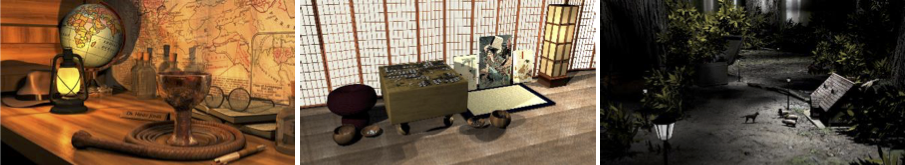

# Proyecto Integrador - _Una Escena Fotorealista_

  

## Objetivo

En este trabajo deben diseñar y desarrollar un programa que genere una escena fotorealista interactiva de atractivo artístico. Para ello, deben usar todos los contenidos vistos durante el dictado de la materia.

## Sobre el Proyecto Integrador

Este Proyecto consta de:

- Diseño y desarrollo de un programa que genere una escena interactiva y de las interacciones correspondientes.
- Presentación de una imagen final representativa de la escena que generen usando su programa (dos variantes).

La escena debe ser una escena coherente y debe incluir diversos recursos que ustedes modelen y/o encuentren en línea. En la escena deben tener al menos un objeto cuya geometría diseñen ustedes. Los objetos deben estar posicionados, texturados e iluminados de modo tal que la escena sea coherente.
Pueden usar cualquier recurso/s que consideren adecuado/s. Dado que se les calificará dando considerable peso a sus méritos artísticos en lo que respecta a la constitución de la escena, les recomendamos que dediquen tiempo a pedir opiniones a los docentes, amigos, familia, etc. sobre la misma.

## Logística

Todos los documentos deben subirse online antes de la presentación. Puede subir las presentaciones todas las veces que quieran para no correr el riesgo de no tenerla el día de la presentación del Proyecto Final. Sin embargo, la última presentación que suban antes del deadline será la que se evaluará.

## Fechas importantes

Cronograma disponible en la [version PDF del enunciado](docs/Proyecto-integrador.pdf).

Durante este tiempo se verá la implementación de distintos temas prácticos que les permitirán mejorar la presentación de su Proyecto Final:

- Implementación de sombras.
- Modelado Jerárquico. Implementación escena orientada a objetos.
- Exposición Proyecto Final - _Natus Rendering Engine_.
- Corrección gamma. Pick de objetos 3D. sRGB, HDR, etc.
- Sistemas de partículas.
- Supermuestreo. Esto les permitirá reproducir la misma escena con mayor frecuencia de muestreo y resolución de imagen para obtener una imagen final de mayor calidad.

## Calificación

Tanto la escena como la imagen serán calificadas principalmente por sus méritos artísticos; claramente también se evaluará su calidad técnica. Tanto las escenas como las imágenes se ubicarán en una de las 10 categorías que se establecen. Cada categoría representa escenas/imágenes de aproximadamente la misma calidad. Las escenas/imágenes de la categoría 1 son las de peor calidad, mientras que las de la categoría 10 son las de mejor calidad. Dentro de cada categoría, cada escena/imagen será clasificada. Por ejemplo, una escena/imagen que es categoría 10 rango 2 se considera de menor calidad que una escena/imagen que es categoría 10 rango 5. Sin embargo, ambas serían de mayor calidad que cualquier escena/imagen en la categoría 9. Cualquier contribución técnica planteada será tomada en consideración cuando se asignen las categorías/los rangos. Las contribuciones técnicas por sí solas no le darán una buena calificación. Luego, se asignará una nota a cada categoría (puede verse entre paréntesis):

1. (4 ó 5). La escena (e imagen) carece de complejidad y/o exhibe artefactos serios. Las interacciones con la escena y sus elementos no son naturales y/o no son adecuadas.
2. (4 ó 5). La escena (e imagen) tiene problemas significativos con la textura, la iluminación, las sombras y/o la geometría. Las interacciones con la escena y sus elementos no son naturales y/o no son totalmente adecuadas.
3. (6). Incorpora modelos más sofisticados y/o modelos a medida. La escena sigue siendo muy sencilla o tiene problemas de iluminación, de sombras o de texturas. Incorpora algunas interacciones relativamente adecuadas aunque no son muy naturales o viceversa.
4. (6). La escena (y las imágenes) es más coherente/organizada que en las categorías anteriores, pero no es (son) tan atractiva (/s) estéticamente como la/s de las categorías más altas. Incorpora interacciones relativamente adecuadas aunque no son muy naturales o viceversa.
5. (7). La escena (y las imágenes) tanto en esta categoría como en categorías más altas exhibe) un atractivo estético a través de un enfoque/narrativa. Se distingue(/n) por algún mérito artístico o trabajo técnico, pero todavía puede(/n) carecer de complejidad o tener algunos problemas con la iluminación, las sombras o las texturas. Incorpora interacciones relativamente adecuadas y bastante naturales.
6. (8). La escena (y la imagen) se ve bien dado el uso efectivo de la iluminación, la geometría personalizada, las sombras o una buena composición. Incorpora interacciones adecuadas y bastante naturales en relación con categorías anteriores.
7. (8). La escena es (y las imágenes son) más compleja(/s) que la (/s) de las categorías anteriores. Contiene (/n) una gran atención a los detalles, al uso eficaz de la iluminación y de las sombras y / o esfuerzo técnico. Fuerte atractivo artístico/estético. Incorpora interacciones adecuadas y naturales.
8. (8). La escena (y las imágenes) tiene(/n) buena iluminación, sombras y geometría. Tanto la escena como las imágenes son cohesivas y son más atractivas estéticamente que las de las categorías anteriores. Incorpora interacciones muy adecuadas y naturales en relación con categorías anteriores.
9. (9). Excelente composición escénica y mérito artístico. Pocos o ningún artefacto visible. Incorpora interacciones muy adecuadas y naturales.
10. (10). Mérito técnico/artístico superior a través del uso efectivo de geometría personalizada, shaders personalizados y composición de escenas. Escena completa con excelente ejecución. Incorpora interacciones sumamente adecuadas y muy naturales.

También se considerarán para la evaluación, las rúbricas de Presentación y Exposición Oral presentadas en el Proyecto 3 y las de Trabajo en Equipo presentadas en el 1.
La nota se integrará considerando todos los requerimientos exigidos.

## Un último consejo

Por favor, ¡utilice los recursos con que cuenta a su favor! Recomendamos venir a las prácticas para obtener realimentación sobre su proyecto a medida que lo desarrolla. Le daremos comentarios sinceros para ayudarlo a mejorar la calificación del mismo. Queremos que todos tengan éxito y estamos aquí para ayudarlos.

